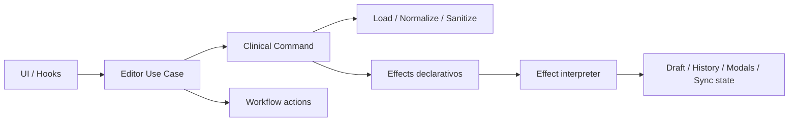

# Arquitectura del Sistema: Clinical Records App

Este documento detalla la estructura y el flujo de datos de la aplicación "Cartola de Medicamentos e Informes Médicos".

## 1. Patrón General: Separación de Responsabilidades
La aplicación está construida sobre React (TypeScript + Vite) y sigue una arquitectura orientada a **componentes de composición**, **hooks de coordinación**, **contextos de estado**, **servicios de frontera** y **utilidades puras**.

### Capas del Proyecto (`src/`)
- **/components:** Presentación y composición visual. La carpeta `components/app/` concentra el ensamblaje del editor principal (`AppShellContent`, `AppWorkspace`, `AppModals`).
- **/contexts:** Estado global y contratos compartidos (`RecordContext`, `AuthContext`, `DriveContext`).
- **/hooks:** Coordinación React reutilizable y adaptadores de UI (`useDriveModals`, `useRecordTitleController`, `useHhrIntegrationController`, etc.).
- **/domain:** Reglas clínicas puras, versionado y pipeline de carga del `ClinicalRecord`.
- **/application:** Casos de uso puros y reducer del workflow del editor.
- **/infrastructure:** Gateways browser-side tipados para Drive, Google Auth y HHR.
- **/services / utils:** Integraciones legacy y utilidades puras reutilizadas por las capas superiores.

## 2. Flujo de Datos Principal (RecordContext)
El estado de la "Ficha Clínica Actual" (el paciente que se está editando) reside centralmente en `RecordContext`.
1. `App.tsx` crea providers y rutas; `AppShellContent` ensambla el editor.
2. La UI lee datos mediante `useRecordContext()`.
3. Las mutaciones del formulario viajan por `useRecordForm`, que emite comandos clínicos explícitos.
4. Los comandos pasan por `application/clinicalRecordCommands.ts`, donde se valida si están permitidos según el workflow, se normaliza el resultado y se emiten `effects` declarativos.
5. `useClinicalRecord` interpreta efectos locales, mantiene el reducer de workflow (`dirty/saving/restoring/importing/syncing/error`) y coordina persistencia local.
6. Los casos de uso de editor (`application/editorUseCases.ts`) encapsulan importación, restore, save draft, reset y HHR, devolviendo resultado + transiciones de workflow + effects.

## 3. Manejo de Almacenamiento y Archivos Remotos
1. **Google Drive:** `AuthContext` mantiene la sesión y `DriveContext` orquesta el estado de navegación.
2. **Gateway tipado:** `infrastructure/drive/driveGateway.ts` encapsula `window.gapi` y devuelve `Result` explícito.
3. **UI de Drive:** `useDriveModals` coordina modales/Picker y `useDriveSearch` resuelve búsqueda, caché, progreso y cancelación.
   La búsqueda ahora distingue entre modo rápido por metadata y búsqueda profunda por contenido con presupuesto/cancelación.
4. **Persistencia local:** `storageAdapter.ts`, `settingsStorage.ts` y `driveFolderStorage.ts` concentran lectura/escritura en navegador.
   Las API keys sensibles se mantienen en sesión; la configuración estable sigue persistiendo localmente.

## 4. IA Asistida (Gemini API)
La capa de IA está separada por responsabilidad:
- **`geminiCatalogClient.ts`:** catálogo/modelos accesibles.
- **`geminiRoutingResolver.ts`:** descubrimiento `v1`/`v1beta` y caché de routing.
- **`geminiGenerationClient.ts`:** generación de contenido y retries.
- **`geminiClient.ts`:** fachada pública estable para el resto de la app.
- Las credenciales/configuración se persisten localmente mediante `settingsStorage.ts`.

## 5. Decisiones de Renderizado y Rutas
Se usa `react-router-dom` para separar vistas pesadas:
- `/` (Home): el editor principal compuesto por `AppShellContent` y `AppWorkspace`.
- `/cartola`: La visualización histórica de prescripciones (CartolaMedicamentosView).

## 6. Dominio Cartola
- `components/cartola/useCartolaState.ts` concentra estado y casos de uso del módulo.
- `components/cartola/cartolaDomain.ts` contiene reglas puras: normalización, naming de exportación y utilidades de dominio.
- `components/cartola/CartolaApp.tsx` quedó como componente de composición, sin la mayor parte de la lógica de negocio inline.

## 7. Frontera de Datos Clínicos
- `domain/clinicalRecord.ts` define el pipeline oficial:
  `parseClinicalRecordInput -> migrateClinicalRecord -> normalizeClinicalRecord -> sanitizeClinicalRecord`.
- `validationUtils.ts` mantiene compatibilidad hacia afuera, pero delega la frontera principal en `loadClinicalRecord`.
- `clinicalContentSanitizer.ts` define el HTML permitido en secciones clínicas antes de persistir o renderizar.
- `useClinicalRecord`, `useFileOperations` y `useDriveOperations` consumen esa frontera para drafts locales, importaciones y aperturas remotas.

## 8. Casos De Uso Y Gateways
- `application/clinicalRecordCommands.ts` concentra el modelo de comandos, políticas por estado, metadata de historial y efectos declarativos.
- `application/editorUseCases.ts` resuelve importación, restauración, save draft, reset, carga HHR y preflight de sincronización.
- `application/editorEffects.ts` interpreta effects en capa React sin mezclar decisión de negocio con side effects.
- `application/clinicalRecordUseCases.ts` mantiene utilidades puras y compatibilidad con contratos anteriores.
- `application/editorWorkflow.ts` centraliza el estado operativo del editor sin acoplarlo a componentes concretos.
- `infrastructure/auth/googleAuthGateway.ts` aísla el acceso a `window.google` y `window.gapi` del `AuthContext`.
- `infrastructure/hhr/hhrGateway.ts` envuelve login, logout y persistencia clínica HHR con resultados tipados.
- `infrastructure/shared/resilience.ts` centraliza timeouts y retries para Drive, Auth y HHR.

## 9. Historial Local Inteligente
- Cada entrada local puede incluir `commandType`, `commandCategory`, `changed`, `summary` y `groupKey`.
- Los snapshots redundantes no se persisten.
- Cambios consecutivos compatibles dentro de una ventana de 2 minutos se agrupan en una sola entrada.
- Internamente `useClinicalRecord` ya mantiene una estructura `past/present/future` para preparar undo/redo futuro sin exponer todavía esa UI.

## 10. Flujo Resumido

