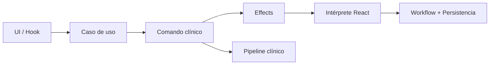
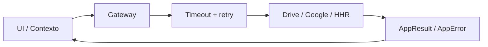

<div align="center">

</div>

# Run and deploy your AI Studio app

This contains everything you need to run your app locally.

View your app in AI Studio: https://ai.studio/apps/drive/1gRaJgpJCj1Y4n8qkayhtcipE3dxXN8qO

## Run Locally

**Prerequisites:**  Node.js

Usa la versión definida en [.nvmrc](.nvmrc) (`20.19.0` o superior) para evitar diferencias entre local y CI.


1. Install dependencies:
   `npm install`
2. Set the `VITE_GEMINI_API_KEY` (or legacy `GEMINI_API_KEY`) in [.env.local](.env.local) to your Gemini API key for the Generative Language API. If your key was created inside Google Cloud Console (instead of Google AI Studio), also set `VITE_GEMINI_PROJECT_ID`/`GEMINI_PROJECT_ID` to the numeric project ID so the app can send the required `X-Goog-User-Project` header. Google Cloud keys also need the **serviceusage.serviceUsageConsumer** role (or a custom role with `serviceusage.services.use`) on that project; if you can't grant it, leave the project field empty and rely on an AI Studio key instead. Optionally, define `VITE_GEMINI_MODEL`/`GEMINI_MODEL` to force a specific model. The assistant now probes the Gemini catalog before every session: it autodetects whether the model should be called through `v1` or `v1beta`, automatically retries with the alternate endpoint if the API reports an incompatible combination, and—if the requested model is missing—first surfaces the list of models that *are* enabled for your key and then automatically switches to the best available option whenever you left the model field blank. If you need to force a specific endpoint, add the suffix `@v1` or `@v1beta` (e.g., `gemini-1.5-flash-latest@v1beta`).
   Si vas a usar la integración bidireccional con HHR/Firebase, agrega además las variables del proyecto clínico central:
   `VITE_FIREBASE_API_KEY`, `VITE_FIREBASE_AUTH_DOMAIN`, `VITE_FIREBASE_PROJECT_ID`, `VITE_FIREBASE_STORAGE_BUCKET`, `VITE_FIREBASE_MESSAGING_SENDER_ID`, `VITE_FIREBASE_APP_ID` y opcionalmente `VITE_HHR_FIREBASE_HOSPITAL_ID` (por defecto usamos `hanga_roa`).
3. Run the app:
   `npm run dev`

### Integración HHR / Firebase

La app ahora puede:

1. Iniciar sesión con Google en Firebase para usar el mismo acceso clínico del proyecto HHR.
2. Leer en tiempo real el censo diario desde `hospitals/{hospitalId}/dailyRecords/{YYYY-MM-DD}`.
3. Auto-completar el formulario clínico con nombre, RUT, edad, fecha de nacimiento, fecha de ingreso y cama.
4. Guardar un borrador clínico en `hospitals/{hospitalId}/clinicalDocuments/{documentId}` con versionado básico por sesión.

Notas de implementación:

- El botón `Guardar en Ficha HHR` requiere sesión HHR activa y al menos `Nombre` + `RUT`.
- La escritura usa `clinicalDocuments`, porque las reglas permiten guardar borradores clínicos para médicos y administradores.
- La subida a `Firebase Storage` para documentos tipo cartola/entrega no se fuerza desde este editor, ya que ese flujo depende de metadatos de turno que este formulario no conoce todavía.

## Frontera de datos clínicos

La carga de registros clínicos quedó unificada. Importación local, apertura desde Drive, restauración de historial y drafts locales pasan por el mismo pipeline:

1. parseo estructural,
2. migración a `CURRENT_RECORD_VERSION`,
3. normalización de campos y títulos,
4. sanitización del HTML clínico permitido.

Esto reduce divergencias entre fuentes de datos y evita persistir snapshots sin normalizar.

## Validación de calidad

Antes de abrir un PR o desplegar cambios, ejecuta esta secuencia:

```bash
npm run lint
npm run typecheck
npm run typecheck:test
npm run test:ci
npm run build
npm run check:bundle
```

El editor principal además usa un workflow central (`idle`, `dirty`, `saving`, `restoring`, `importing`, `searching_drive`, `syncing_hhr`, `error`) para mantener coherentes autoguardado, restauración e integraciones remotas.
Las operaciones críticas ahora pasan además por comandos clínicos explícitos y casos de uso de editor, que devuelven `effects` declarativos para separar decisión de negocio y reacciones de UI.
El header expone `Deshacer` / `Rehacer` sobre snapshots persistidos, reutilizando exactamente el mismo pipeline clínico que la restauración desde historial.

### Personaliza el nombre y los logos de la institución

La aplicación ya no está ligada al Hospital Hanga Roa. Puedes definir el nombre y los logos de tu centro médico creando un archivo `.env.local` (o usando variables de entorno en tu plataforma de despliegue) con cualquiera de estos valores:

```bash
VITE_INSTITUTION_NAME="Hospital General de Ejemplo"
VITE_LOGO_LEFT_URL="https://tu-dominio.com/logo-izquierdo.png"
VITE_LOGO_RIGHT_URL="https://tu-dominio.com/logo-derecho.png"
```

Si no los defines, seguiremos usando el nombre y los logos predeterminados para mantener la compatibilidad con instalaciones existentes.

## Asistente de IA en el editor

El modo de edición avanzada ahora incluye un asistente de IA que puede mejorar, resumir o expandir el contenido de cada sección clínica. Para activarlo tienes dos opciones:

1. Define la variable de entorno `GEMINI_API_KEY` antes de iniciar la app (por ejemplo en `.env.local`).
2. O bien, abre **Configuración → IA** dentro de la aplicación e ingresa tu clave de la API de Gemini; la API key sensible se conserva solo durante la sesión activa del navegador, mientras que el proyecto/modelo pueden persistirse localmente. Si la clave proviene de Google Cloud Console, ingresa también el número del proyecto para adjuntarlo en la cabecera `X-Goog-User-Project` y asegúrate de que tu cuenta tenga el rol **serviceusage.serviceUsageConsumer** en ese proyecto. Desde el mismo modal puedes indicar opcionalmente el modelo de Gemini; si lo dejas vacío usaremos `gemini-1.5-flash-latest`, comprobaremos automáticamente en qué versión (`v1` o `v1beta`) está disponible y, si tu clave no tiene acceso, tomaremos el primer modelo general disponible de tu catálogo y lo activaremos para ti. Si escribes otro modelo también lo validaremos antes del primer uso y, si tu clave no tiene acceso a ese modelo, te mostraremos en pantalla el catálogo de modelos que sí están habilitados para que cambies la configuración sin adivinar.

### Configurar Gemini desde cero

1. Ingresa a [Google AI Studio](https://ai.google.dev/) y crea una **API key** nueva. Copia el valor tal cual aparece en el modal de confirmación; no la compartas públicamente.
2. (Opcional) Si necesitas que la facturación se asocie a un proyecto de Google Cloud, crea la clave desde Google Cloud Console o vincúlala allí, copia el **número** del proyecto y otorga a tu usuario el rol `serviceusage.serviceUsageConsumer`. Ese número es el que debes escribir en el campo "Proyecto de Google Cloud" del modal de configuración o en la variable `VITE_GEMINI_PROJECT_ID`.
3. Abre la aplicación, entra a **Configuración → IA** y pega tu clave. Si prefieres manejarla vía variables de entorno, crea un archivo `.env.local` con `VITE_GEMINI_API_KEY="tu-clave"` antes de ejecutar `npm run dev`.
4. (Opcional) Ajusta el modelo. Por defecto usamos `gemini-1.5-flash-latest`, pero puedes escribir cualquier otro (`gemini-pro`, `gemini-1.5-pro-latest`, etc.). El sistema probará automáticamente los endpoints `v1` y `v1beta` hasta encontrar el que realmente existe para tu cuenta; si ninguno responde, listaremos los modelos disponibles según tu API key y, cuando el campo está vacío, cambiaremos automáticamente al primero compatible para que no tengas que adivinar.

Una vez configurada la clave, habilita la edición avanzada y usa el botón 🤖 de la barra de edición superior para desplegar/ocultar las herramientas de IA en todas las secciones al mismo tiempo.

> ℹ️ **Límites gratuitos de Gemini**: las claves nuevas creadas desde Google AI Studio comienzan con una cuota pequeña (por ejemplo, ~15 solicitudes por minuto). Si ves el error `Quota exceeded for quota metric 'Generate Content API requests per minute'`, significa que alcanzaste ese límite temporal. Espera un minuto y vuelve a intentarlo o habilita la facturación del proyecto para poder solicitar un aumento de cuota desde el panel de Google AI Studio.

### Verificar tu clave rápidamente

Incluimos un script mínimo para probar que la clave y el endpoint correcto (`/v1` o `/v1beta` según el modelo elegido) funcionan. Por omisión usa `gemini-1.5-flash-latest`, pero puedes ajustarlo con la variable `GEMINI_MODEL` (acepta sufijos `@v1`/`@v1beta` para forzar una versión) y, al igual que la aplicación, cambiará automáticamente al primer modelo disponible de tu catálogo si el predeterminado no está habilitado:

```bash
GEMINI_API_KEY="tu-clave" GEMINI_PROJECT_ID="1056053283940" GEMINI_MODEL="gemini-1.5-flash-latest" npx tsx test-gemini.ts
```

Si todo está OK, verás el mensaje `Hola, funciono correctamente`. Si la clave solo tiene acceso a ciertos modelos, el script (al igual que la aplicación) te mostrará qué modelos están disponibles y usará automáticamente el primero compatible antes de fallar. Si hay errores de cuota o de permisos, también verás la respuesta completa de la API para ayudarte a diagnosticarlos. Puedes omitir `GEMINI_PROJECT_ID` si tu clave es de Google AI Studio.

## Plan de mejoras incrementales de calidad

Para guiar refactors seguros y graduales (modularidad, estabilidad, escalabilidad y pruebas), revisa el plan técnico en [`docs/quality-improvement-plan.md`](docs/quality-improvement-plan.md).

## Control de tamaño de bundle

Después de compilar (`npm run build`), puedes validar que el chunk JS más grande no supere el umbral esperado:

```bash
npm run check:bundle
```

La compilación ahora separa chunks por dominio (`react`, `router`, `drive`, `auth`, `hhr`, `ai`, `cartola`, `pdf`) para reducir el peso del shell principal.

El chequeo valida además presupuestos por dominio:

- `index`: `200 kB`
- `google`: `120 kB`
- `hhr`: `520 kB`
- `pdf`: `650 kB`
- `ai`: `180 kB`
- `cartola`: `220 kB`

Opcionalmente, ajusta el límite global con `MAX_MAIN_CHUNK_KB` (por defecto: `800`) o los límites por dominio con `MAX_INDEX_CHUNK_KB`, `MAX_GOOGLE_CHUNK_KB`, `MAX_HHR_CHUNK_KB`, `MAX_PDF_CHUNK_KB`, `MAX_AI_CHUNK_KB` y `MAX_CARTOLA_CHUNK_KB`.

## Troubleshooting operativo

- Importación inválida: si un JSON no supera parseo, migración o sanitización, el editor conserva el documento actual y muestra error sin romper la sesión.
- Drive parcial: la búsqueda profunda puede responder con `partial = true` cuando se cancela, supera el presupuesto de tiempo o alcanza el límite de archivos inspeccionados.
- Guardado HHR fallido: la UI consume `AppError` enriquecido con `operation`, `transient`, `httpStatus?` y `details?`; reintentar manualmente solo tiene sentido cuando `transient = true`.
- Google Auth: el perfil intenta primero la API remota con timeout/retry; si eso falla y existe `id_token`, se completa el perfil localmente.

## Flujo de edición resumido



## Flujo resumido de integraciones


